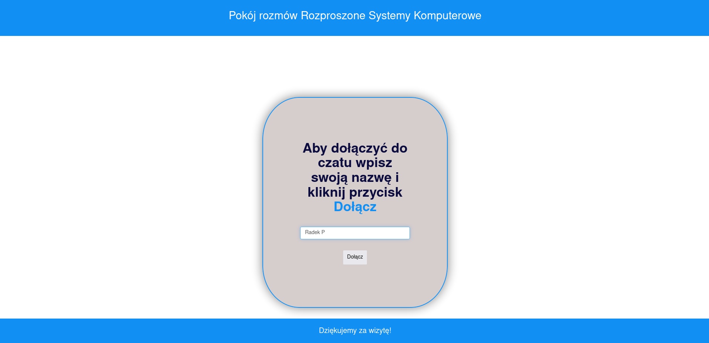
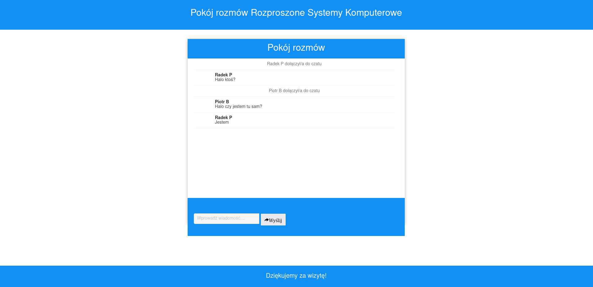
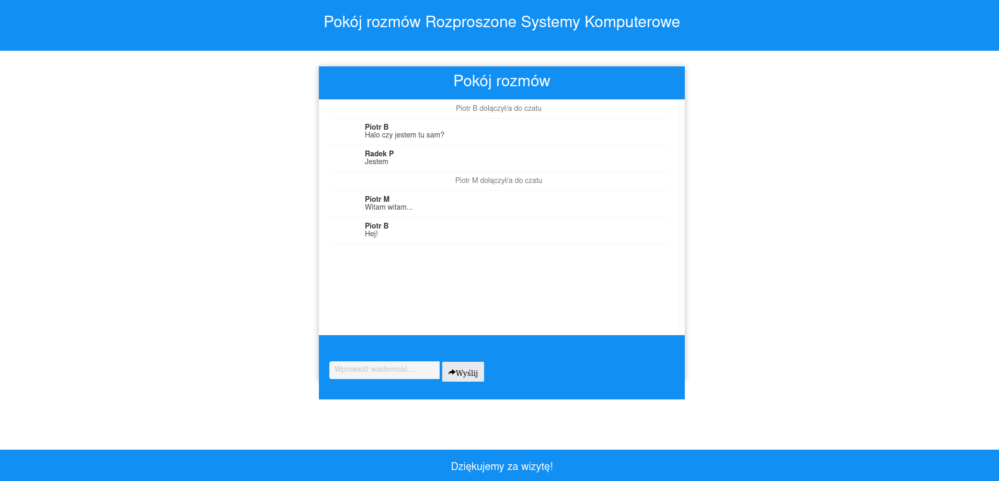
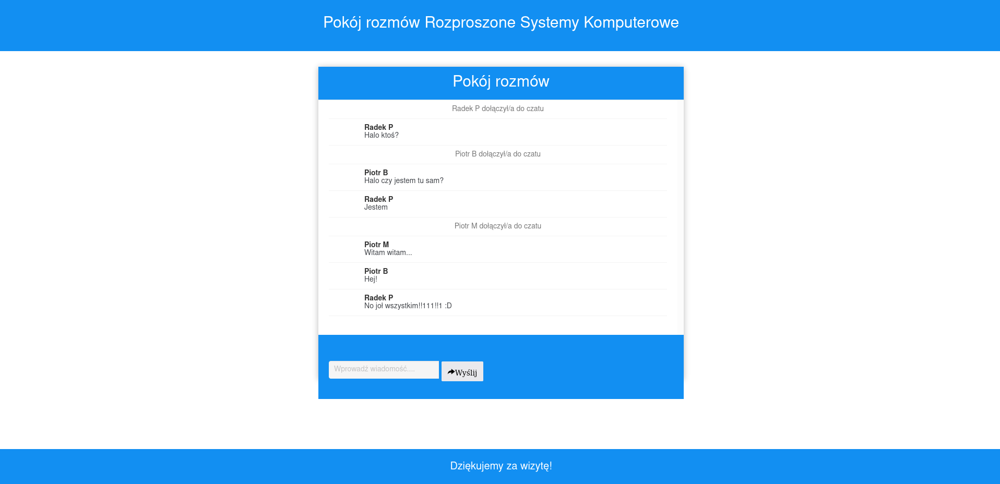

# chatbox-mq-rabbit
## prezentacja
### Logowanie użytkownika:

### Wpisywanie wiadomości:

### Wysłana wiadomość:

### Drugi użytkownik dołączył do czatu i wysłał wiadomość:

### Wyświetlenie i odpisanie na wiadomość drugiego użytkownika:

### Trzeci użytkownik dołącza do czatu:

### Konwersacja pomiędzy użytkownikami:

